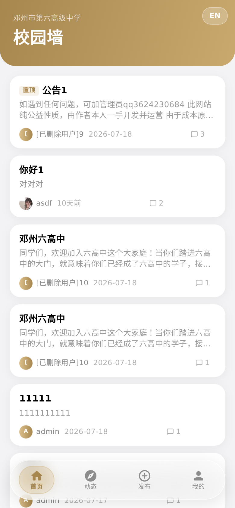
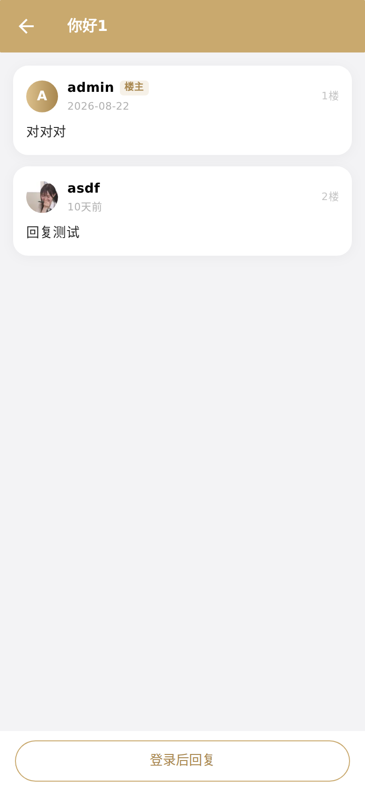
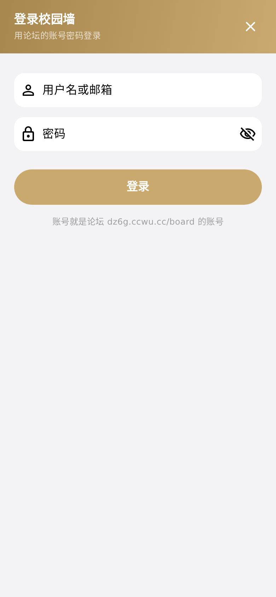

<div align="center">

# 校园墙 · dz6g_app

**邓州市第六高级中学校园墙的安卓客户端**

<sub>Flarum 论坛「校园墙」的原生 App · Flutter 编写 · 内置 DoH 绕开运营商 DNS 污染</sub>

<br>

[](https://github.com/FeiYang-sudo/dz6g-app/actions/workflows/build.yml)


[](https://github.com/FeiYang-sudo/dz6g-app/stargazers)

<br>

[](https://dz6g.ccwu.cc/dl/)

<br>





<sub>截图取自同一份 Dart 代码构建的 Web 版本，由本机渲染截取</sub>

</div>

---

## 📱 下载

| 版本 | 适用机型 | 大小 | 直链 |
|---|---|---|---|
| **arm64-v8a** | 大多数近几年手机（推荐） | 8.5 MB | [下载](https://dz6g.ccwu.cc/dl/dz6g-app-arm64.apk) |
| **armeabi-v7a** | 老机型 / 32 位 | 8.1 MB | [下载](https://dz6g.ccwu.cc/dl/dz6g-app-armv7.apk) |

下载页：**<https://dz6g.ccwu.cc/dl/>** · 不确定选哪个就装 `arm64`，装错了会在安装时提示架构不符，换另一个即可。
Android 7.0 及以上。

## ✨ 功能

- **看帖**：首页帖子流，支持下拉刷新、上拉加载更多、图片、富文本（Flarum 的 HTML 帖子内容）
- **互动**：帖子详情 + 回复、发新帖
- **账号**：用论坛账号登录；登录态存在手机本地，启动时后台校验一次，token 失效自动登出
- **我的**：个人资料、头像
- **外观**：玻璃态底部导航 + 金色头部，和官网同一套「黑金 + 琉璃」视觉
- **连不上时能说清原因**：不显示 "网络错误" 这种废话，而是把真实异常 + 三路探路结果摆出来（主站 / IP 直连 / Cloudflare）

## 🛡 一个不太常见的设计：内置 DoH

这个 App 里最值得说的不是界面，是 `lib/doh_client.dart`。

**问题**：部分运营商/校园网的 DNS 会把 `dz6g.ccwu.cc` 解析成 `0.0.0.0`（黑洞地址），于是同一台手机「移动数据能打开、某个 Wi-Fi 打不开」，而且改服务器完全没用——是那家运营商的解析被污染了。

**做法**（客户端自救，装上就能用，不需要每个人去改手机设置）：

1. 不再信任系统 DNS，改用**加密 DNS（DoH）**拿真实 IP —— 内置阿里 `dns.alidns.com`、腾讯 `doh.pub`、360 `doh.360.cn` 三个国内端点，任一可用即可
2. 拿到 IP 后**自己建 socket 连那个 IP**（`HttpClient.connectionFactory`）
3. 但 TLS 的 **SNI 与证书校验仍然按域名走**（`SecureSocket.secure(host: 域名)`）
   —— 也就是说 **不是**"关掉证书校验"那种做法（`badCertificateCallback => true` 一律别用）
4. 只有 `dz6g.ccwu.cc` / `auth.dz6g.ccwu.cc` 走 DoH，别的域名照常系统解析，避免无谓开销
5. 解析结果缓存 5 分钟；失败则回落到系统解析，不会把 App 卡死

`lib/doh_client.dart` 在 Web 上是空实现（浏览器不给自定义 DNS），条件导出在 `doh_client_web.dart`，所以同一份代码既能打 APK 也能 `flutter build web`。

## 🧱 技术栈

| 方面 | 用了什么 |
|---|---|
| 框架 | Flutter 3.27.1 / Dart 3（Material 3） |
| 数据 | Flarum JSON API（`https://dz6g.ccwu.cc/board/api`，匿名可读、登录后可发帖回复） |
| 依赖 | `http`、`shared_preferences`、`cached_network_image`、`flutter_html`、`url_launcher` |
| 图形 | 无第三方 UI 库，导航栏/头部/卡片都是自己画的 |

> ⚠️ `pubspec.yaml` 里锁了 `html: 0.15.4`，**别删**：`flutter_html 3.0.0` 内部用了 `package:html` 的私有 API（`query_selector.dart` 的 `matches()`），而它在 `html 0.15.5` 起被移除，不锁版本会直接编译报错。

## 🚀 本地构建

```bash
flutter pub get
flutter build apk --release --split-per-abi     # 按 ABI 出两个包
# 产物：build/app/outputs/flutter-apk/app-arm64-v8a-release.apk
#       build/app/outputs/flutter-apk/app-armeabi-v7a-release.apk
```

小内存机器（≤2 GB）构建前先看一眼 `android/gradle.properties` 的 `org.gradle.jvmargs`：
写成 `-Xmx4G` 会必 OOM，改成 `-Xmx1024m -XX:MaxMetaspaceSize=384m` + `org.gradle.daemon=false` 才稳。

## 📦 发布流程（CI 自动出包）

推 `main` → `.github/workflows/build.yml` 自动：

```
flutter analyze → 按 ABI 打 release APK → 上传 artifact（保留 90 天）→ 推到 dl 分支
```

`dl` 分支上的 APK 就是正式产物；官网 `/dl/` 页面挂的是同一份文件（可用 git blob sha 逐字节核对）。

## 🌐 网页版（用于预览 / 截图）

```bash
flutter build web --release --web-renderer html
```

HTML 渲染器走 DOM 文字，中文字体不依赖外网，适合在服务器上截图预览界面。

## 🔗 相关

- 学校官网：<https://dz6g.ccwu.cc/>
- 校园墙（论坛）：<https://dz6g.ccwu.cc/board/>
- 官网源码仓库：[FeiYang-sudo/dz6g](https://github.com/FeiYang-sudo/dz6g)

## 📄 说明

本项目为学校内部使用；账号即校园墙论坛账号；请勿用于商业用途。
